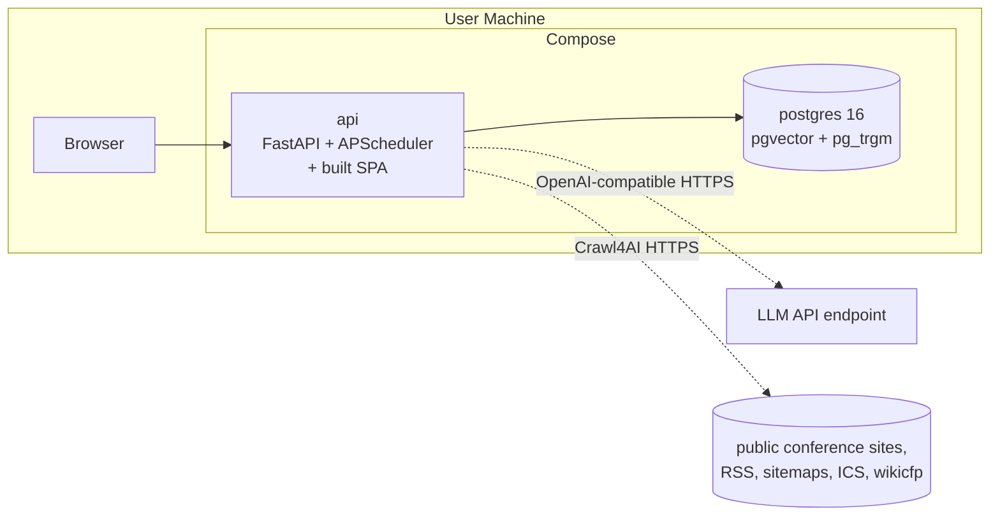
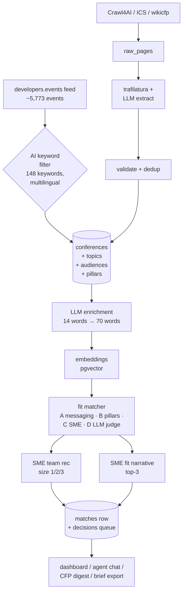

# Scout — Architecture

> **Status:** current as of plans 34/35 + post-plan-33 UX work
> (see [`docs/web-discovery.md`](web-discovery.md) for the discovery pipeline,
> and the [`ADR/`](ADR/) directory for individual architectural decisions).

## One-paragraph summary

Scout is a single-user, locally-installed web app. Two containers come up
via `docker compose up` (or `podman compose up`): **postgres** and **api**.
The api is FastAPI; it serves the JSON API at `/api/v1/*`, the built React
SPA at `/`, and hosts an in-process APScheduler that runs background jobs
(scraping, embedding, matching, decay, CFP digests). The api calls an
OpenAI-compatible LLM endpoint for both chat (an instruction-tuned chat
model) and embeddings (a 768-dim text embedding model).

## System diagram



## Service responsibilities

### `postgres`
- Postgres 16 with `pgvector`, `pg_trgm`, `unaccent`, `pgcrypto`.
- Schemas: `app` (entities + junctions), `vectors` (embeddings), `audit`
  (append-only), `jobs` (APScheduler jobstore). See [ADR-0002](ADR/0002-postgres-schemas-not-databases.md).
- Two roles:
  - `POSTGRES_USER` (from `.env`) — superuser, used by Alembic for migrations only.
  - `app` — runtime role used by the api. SELECT+INSERT+UPDATE+DELETE on
    `app`/`vectors`/`jobs`; **only SELECT+INSERT on `audit`** (defense in depth).
- Backed by named volume `postgres_data`.
- Init SQL: `infra/postgres/init/01-extensions.sql` (extensions) and
  `02-roles-and-schemas.sql` (schemas + role + default privileges).
- Operator runbook: [`docs/ops/database.md`](ops/database.md). Backups: [`docs/ops/backups.md`](ops/backups.md).

### `api`
- FastAPI app (`apps/api/app/main.py`).
- Hosts an `AsyncIOScheduler` started in the FastAPI lifespan.
- Serves the SPA built by `apps/web` as static files at `/`.
- Talks to the LLM API via an OpenAI-compatible client. No direct network calls
  to model inference outside of that endpoint.

### Web discovery (`app/services/web_discovery/`)

Scout's two-track event-finding pipeline. See
[`web-discovery.md`](web-discovery.md) for the full narrative; the
short version:

- **`feeds.py`** — bulk ingest of the
  [`developers.events`](https://developers.events/all-events.json) JSON
  feed (~5,773 events). Structured fields (date, city, country, CFP url
  + deadline, tags) bypass the LLM extractor entirely. Events are
  filtered through a multilingual AI keyword list before persistence
  (see "AI filter" in [`web-discovery.md`](web-discovery.md)). Embedding
  happens inline so the matcher's Stage A + B have something to score
  against on the first pass.
- **`crawler.py`** — Crawl4AI wrapper. Uses the
  `AsyncHTTPCrawlerStrategy` (no Playwright) for speed and a smaller
  image. Given a list of seed URLs, fetches each one and follows
  conference-looking outbound links one level deep (capped via
  `discovery_max_links_per_seed`).
- **`search.py`** — pluggable web-search adapters. `ddg` (default; no
  key, occasionally rate-limited), `brave` (1 req/s, 2000/month free),
  `tavily` (1000/month free). Provider chosen by the
  `discovery_search_provider` setting; keys live in `.env`.
- **`orchestrator.py`** — top-level `run_discovery()`. Wires search →
  Crawl4AI fetch → `RawPage` row → existing `parse_raw_page` extraction
  → conferences. Called by the admin endpoint and by the nightly
  APScheduler cron.

### Geocoding (`app/services/geocoding.py`)

Wraps OpenStreetMap's [Nominatim](https://nominatim.openstreetmap.org/)
(free, no API key). Honors the 1 req/sec policy with a 1.05-second
delay and a process-wide `asyncio.Lock` so concurrent callers stay
serialized. Each successful lookup populates
`Conference.latitude` / `Conference.longitude` (added in migration
`20260523_0100_conferences_latlng`).

Backfill via `POST /api/v1/admin/discovery/geocode-backfill`; commits
every 20 rows so the dashboard map populates incrementally instead of
only at the end of a ~9-minute run for 500 rows. The dashboard
`WorldMap` consumes `GET /api/v1/conferences/stats/by-location`.

### Matcher (four stages)

The matcher answers "how well does this conference fit our strategy?"
in four progressively more semantic stages. Each stage returns a
0..1 score; the operator-configurable weighted blend in
`overall_score` is what the dashboard sorts by.

```
Stage A — Messaging fit
  Top-K mean cosine between the conference's embedded text and the
  active messaging-doc chunks, rescaled into [0, 1] against an
  empirical floor/ceiling, blended 55/45 with a lexical co-signal
  that scores keyword overlap against the auto-extracted vocabulary
  of the active messaging corpus. See app/services/matcher/messaging.py
  + lexical.py.

Stage B — Pillar alignment
  Cosine between conference text and each of the operator's strategic
  pillars (using the long-form ``enriched_description`` extracted
  from the messaging PDFs, not the short tagline). Aggregated via
  softmax-based DISTINCTIVENESS rather than max-across-pillars: a
  conference peaked on ONE pillar (high cosine to it, low to the
  rest) scores high; a conference uniformly relevant to all 4
  (generic AI adjacency) scores moderate; an off-topic event scores
  low. See app/services/matcher/pillars.py.

Stage C — SME fit
  Weighted blend of topic-overlap, audience-overlap, bio-similarity,
  location, and past-attendance signals across the operator's SME
  roster. Returns the top-N composite score. See sme_ranker.py.

Stage D — LLM-as-judge (cross-encoder reranker)
  One LLM call per conference asking llama-scout-17b to score the
  conference against the full pillar context on a calibrated
  0..100 scale, with a one-sentence rationale stored in
  ``matches.judge_rationale`` for UI display. Stage D catches
  alignment the cosine/lexical signals miss because they work on
  averages and surface tokens; the LLM reasons about intent.
  Disable via the ``enable_llm_judge`` setting to save LLM cost —
  ``overall_score`` then re-normalizes across A/B/C only.
  See app/services/matcher/judge.py.

  v2.1 enhancements:
  - Few-shot calibration: prepends recent approve/reject decisions
    from app.decisions as in-context examples so the judge learns
    operator taste over time. See calibration.py.
  - Response cache: SHA-256 of (conf text + pillar text + examples
    + prompt version) → matches.judge_input_hash. Cache hits skip
    the LLM call entirely; typically 90%+ hit rate on bulk rescores.

Post-matcher boosts
  Small (+/- 0.10) nudges applied to overall_score AFTER the
  four stages produce their weighted blend:
  - CFP urgency (+0.10) if cfp_close_at in next 30 days
  - Recency penalty (-0.05) if start_date > 12 months out
  - Series memory (+0.10) if any past edition was approved
  These are pure business logic — no LLM, no embeddings — and
  each toggleable individually. See boosts.py.
```

Cosine alone is not enough for this corpus because
``nomic-embed-text-v1-5`` produces a narrow cosine band (p95 ≈ 0.05
for short-form-vs-long-form pairs); without the lexical co-signal,
the distinctiveness aggregation, and the LLM judge, every AI
conference scores ~100% on at least one stage and the matcher
provides no ranking signal.

Conference text is itself LLM-enriched at ingest: the bare 14-word
name+topics blob is expanded into a 2-3 sentence factual description
with concrete technical vocabulary (vLLM, MLOps, RAG, …) before
embedding. Strategic pillars get the same treatment: a 500-800 word
LLM-extracted description grounded in the operator's messaging
documents replaces the short tagline at embed time.

#### Ingest → match pipeline

Newly-ingested conferences (developers.events feed OR LLM extraction
from uploaded PDFs/URLs) enqueue one
``enrich_and_match_task(conference_id)`` job that:

  1. LLM-enriches the conference into a 2-3 sentence description.
  2. Re-embeds using that enriched text.
  3. Runs the matcher pipeline (stages A→D, persists the match row).

So new rows are scored within seconds of ingest — no manual rescore
step required.

#### Re-running the matcher

- `GET /api/v1/conferences/{id}/match` / `/brief` will inline-run if no
  match row exists for the current `algorithm_version`.
- `POST /api/v1/admin/matcher/run-now/{id}` — operator one-off.
- `POST /api/v1/admin/matcher/recompute-all` — full rescore (slow).
- Nightly cron re-scores any conference whose inputs changed.

#### References

The judge stage implements the **cross-encoder reranker** pattern from
the modern RAG / dense-retrieval literature. Industry guidance from
2026:

- "From BM25 to Corrective RAG: Benchmarking Retrieval Strategies"
  ([arXiv:2604.01733](https://arxiv.org/abs/2604.01733)) — cross-encoder
  reranking on top of hybrid retrieval yields +17pp MRR@3 and +12pp
  Recall@5 over unreranked hybrid alone.
- "Domain-Adaptive and Scalable Dense Retrieval for Content-Based
  Recommendation" ([arXiv:2602.00899](https://arxiv.org/abs/2602.00899))
  — dense retrieval + reranking for recommender systems.
- [ZeroEntropy reranker guide (2026)](https://zeroentropy.dev/articles/ultimate-guide-to-choosing-the-best-reranking-model-in-2025/)
- [Hybrid Search in Production: Why BM25 Still Wins on the Queries That Matter](https://tianpan.co/blog/2026-04-12-hybrid-search-production-bm25-dense-embeddings)

We use the chat LLM as the cross-encoder (LLM-as-judge) rather than
a dedicated reranker model because the operator's MaaS key only
exposes ``llama-scout-17b`` — same idea (model sees both query +
document together and produces a single relevance score), slightly
higher latency, no extra infrastructure required.

### Frontend (`apps/web` — built into the api image)
- Vite 6 + React 19 + TypeScript strict.
- Tailwind v4 (CSS-first config; design tokens in `src/styles/index.css`
  under `@theme`).
- shadcn-style primitives copied into the repo at `src/components/ui/`
  (Button + Card so far; more per-feature).
- TanStack Router (file-based routes under `src/routes/`; auto-generated
  `routeTree.gen.ts` excluded from git).
- TanStack Query for server state.
- `openapi-fetch` consumes types generated from the api's `/api/openapi.json`
  via `pnpm gen:api`.
- Production: built at api-image build time (spa-builder stage of
  `apps/api/Containerfile`) and copied to `/app/static/` — served by FastAPI's
  `StaticFiles` mount. Same origin → no CORS in prod.
- Dev: `cd apps/web && pnpm dev` runs Vite at `:5173` with `/api/*` proxied
  to the api container. Hot module reload.
- Build one-off without rebuilding the full api image: `make build-spa`
  (uses a throwaway UBI node-22 container; output lands in `apps/api/static/`).

## Data flow



The bulk JSON feed (`developers.events`, ~5,773 events) is the workhorse:
structured fields go straight to `conferences` with `confidence_score=0.9`
and inline embeddings, skipping the LLM extractor. The Crawl4AI path is
the fallback for events that don't appear in any feed and for the nightly
on-demand discovery run. See [`web-discovery.md`](web-discovery.md) for
the full pipeline narrative.

## Tech stack

| Layer | Choice | Why |
|-------|--------|-----|
| Language (api) | Python 3.12 | Pydantic v2, async SQLAlchemy, FastAPI maturity |
| Language (web) | TypeScript strict + React 19 | Strong typing matches our generated OpenAPI client |
| Build tool (web) | Vite 5 | Lightweight, no SSR needed; built into the api image |
| Router (web) | TanStack Router | Typed routes, file-based |
| State (web) | TanStack Query | Server state; pairs with `openapi-fetch` |
| UI primitives | shadcn/ui + Tailwind v4 | Copy-into-repo, full customization |
| DB | Postgres 16 + pgvector | Single store; HNSW vector search; Apache AGE not needed (NetworkX in-mem) |
| Background jobs | APScheduler in-process | No Redis; jobs persisted in Postgres |
| Graph | NetworkX in-memory + Postgres junctions | Obsidian-style derived graph |
| LLM client | `openai` SDK pointed at a configurable base_url | Provider-agnostic |
| Scraping | Crawl4AI + `icalendar` + dedicated wikicfp parser | No Playwright |
| Page fetch (discovery) | Crawl4AI `AsyncHTTPCrawlerStrategy` | HTTP-only mode keeps the api image lean; no headless browser dependency |
| Web search (discovery) | `ddgs` (default) + Brave + Tavily adapters | `ddgs` replaced the deprecated `duckduckgo_search` package; provider chosen via `discovery_search_provider` setting |
| Geocoding | Nominatim (OpenStreetMap) | Free, no API key; 1 req/sec policy enforced in-process |
| PDF parsing + chunking | Docling (`DocumentConverter` + `HybridChunker`) | Layout-aware; built-in OCR; replaces pypdf + ocrmypdf + langchain-text-splitters ([ADR-0003](ADR/0003-docling-for-pdf-and-chunking.md)) |
| World map (web) | `react-simple-maps` + self-hosted TopoJSON | Plots geocoded conferences; TopoJSON ships at `/world-110m.json` to dodge v3's silent CDN fetch failures |
| Graph viz (web) | `react-force-graph-2d` | Renders the conference ↔ topic ↔ SME graph derived from Postgres junctions |
| Migrations | Alembic | Standard |

## Data model

The full schema — every table, column, index, and the *why* behind each —
lives in [`data-model.md`](data-model.md). It includes a Mermaid ERD and
per-table notes. Implementation (SQLAlchemy ORM + Alembic migrations) lands
in plan 06.

## Input guardrails

User-entered data is governed by strict Pydantic v2 schemas in
`apps/api/app/schemas/` — `extra='forbid'`, length caps, enums, ISO-3166/639-1
validation. The same schemas are reused by the manual-entry UI (plan 09)
and the XLSX workbook import (plan 31), so both paths apply identical rules.
Operator runbook: [`ops/data-guardrails.md`](ops/data-guardrails.md).

## Secrets

Scout has one financially-sensitive secret (the LLM API key) and two
operational ones (Postgres superuser password, `app`-role password). All
live in `.env` on the user's machine — never in `git`, image layers, command
lines, or logs. Defense layers: `.gitignore` blocks `.env*`; gitleaks
pre-commit scans staged changes; pydantic `SecretStr` prevents accidental
stringification; structlog redactor scrubs known-sensitive keys + bearer/sk-
patterns from log records; `ENV=prod` strips tracebacks from error responses.
Provisioning + rotation + leak response in
[`ops/secrets.md`](ops/secrets.md).

## Glossary

- **SME** — subject-matter expert (your team and external collaborators)
- **CFP** — call for papers; submission window for a conference
- **CFP scout** — the digest job + UI surface that nudges the operator when CFP windows are about to close
- **Pillar** — one of your team's four strategic pillars
- **Audience** — your team's marketing/sales persona
- **Series** — year-over-year linkage between editions of the same conference
- **Match** — the matcher output (scores + recommended SMEs + rationale) for a conference
- **Discovery** — the two-track event-finding pipeline (bulk JSON feed + on-demand Crawl4AI). See [`web-discovery.md`](web-discovery.md).

## Architecture Decision Records

See [`ADR/`](ADR/). The most consequential records:

- [`ADR/0001`](ADR/0001-route-1-local-install-2-containers.md) — Route 1 + local install + 2-container architecture
- [`ADR/0002`](ADR/0002-postgres-schemas-not-databases.md) — Logical separation via Postgres schemas (`app`/`vectors`/`audit`/`jobs`), not multiple databases
- [`ADR/0003`](ADR/0003-docling-for-pdf-and-chunking.md) — Docling for PDF parsing + structure-aware chunking (replaces pypdf + ocrmypdf + langchain-text-splitters)
- [`ADR/0004`](ADR/0004-async-sqlalchemy-and-alembic.md) — Async SQLAlchemy 2.x + Alembic for the data access layer
- (more added as plans complete)

## Build status

Phase 1 is complete; subsequent work has shipped in two areas:
**plan 34** (PDF/Docling OOM hardening via subprocess-isolated tiered
fallback) and **plan 35** (autonomous web discovery — feed ingest,
multilingual AI filter, geocoded city map, inline auto-matcher, edit
UIs for SMEs/Audiences/Messaging, graph force controls). See
[`web-discovery.md`](web-discovery.md) and the [`ADR/`](ADR/)
directory for the relevant design decisions.
