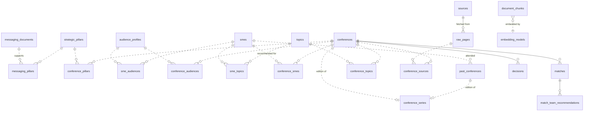

# Scout — Data Model

The authoritative description of Scout's database schema. Every table,
column, index, and the *why* behind each design choice.

- **Implementation**: SQLAlchemy ORM + Alembic migrations under `apps/api/app/db/models/` and `apps/api/alembic/versions/`
- **Schema-level layout (schemas, roles)**: [docs/ops/database.md](ops/database.md) + [ADR-0002](ADR/0002-postgres-schemas-not-databases.md)

## Conventions

Every table follows:

| Concern | Rule |
|---------|------|
| Primary key | `id uuid PRIMARY KEY DEFAULT gen_random_uuid()` |
| Timestamps | `created_at`, `updated_at` — both `timestamptz NOT NULL DEFAULT now()` |
| Attribution | No `created_by` / `updated_by` (no users in Phase 1). Where attribution matters, a free-form `actor_label text` field |
| Deletion | Soft delete via `is_active boolean`. No hard deletes by default |
| Casing | `snake_case` |
| Types | Prefer typed columns over JSON. JSON only where the shape is genuinely open (LLM tool outputs, scrape stats) |

User-input data is governed by the strict Pydantic v2 guardrails under
`apps/api/app/schemas/` (see [`docs/ops/data-guardrails.md`](ops/data-guardrails.md));
the schema's typed columns are the foundation those guardrails validate against.

## ERD overview

## Tables by family

### 1. Manual inputs (`app` schema)

These tables hold the data the team enters via wizards (plan 09) or the
XLSX workbook (plan 31). They're the foundation everything else matches
against.

#### `messaging_documents`
Product messaging and positioning. Drives the matcher's Stage A (messaging fit).

| Column | Type | Purpose |
|--------|------|---------|
| `title` | text | Display label |
| `source_type` | enum (`structured`, `pdf`) | Determines required fields |
| `file_path` | text nullable | Path on the `pdf_uploads` volume (only for `source_type='pdf'`) |
| `elevator_pitch` | text | 50–600 chars; the core positioning sentence |
| `target_personas` | text[] | 1–8 items |
| `key_themes` | text[] | 3–12 items |
| `talking_points` | text[] | 3–15 items |
| `differentiators` | text[] nullable | 0–8 items |
| `competitive_position` | text nullable | 0–600 chars |
| `raw_content` | text nullable | Set for `source_type='pdf'`; powers embedding |
| `is_active` | bool | Inactive docs excluded from matching but kept for history |

#### `audience_profiles`
Marketing/sales personas your team targets.

| Column | Type | Purpose |
|--------|------|---------|
| `name` | text UNIQUE | e.g. "Platform Engineering Lead" |
| `description` | text | 50–500 chars |
| `industry` | text (enum) | From the controlled `industries` vocabulary (seeded via plan 31) |
| `role_seniority` | enum | `executive`/`director`/`manager`/`ic`/`mixed` |
| `primary_pain_points` | text[] | 2–8 items |
| `key_messages` | text[] | 2–8 items |
| `exclusion_criteria` | text[] nullable | 0–5 items |
| `is_active` | bool | |

#### `strategic_pillars`
Your team's four-pillar strategy. Seeded; rarely changes.

| Column | Type | Purpose |
|--------|------|---------|
| `name` | text UNIQUE | Pillar headline (e.g. "Agentic AI innovation") |
| `description` | text | Short operator-authored tagline (~300 chars) |
| `enriched_description` | text nullable | Long-form (500–800 word) LLM-extracted description grounded in the operator's active messaging documents. Matcher Stage B embeds this in preference to `description` because the short tagline doesn't have enough discriminative vocabulary for cosine to separate "fits this pillar" from "AI-adjacent in general." Populated by `scripts/enrich_pillars.py`. |
| `display_order` | smallint | |

#### `smes`
Subject-matter experts — your team members and external collaborators.

| Column | Type | Purpose |
|--------|------|---------|
| `full_name` | text | 3–100 chars |
| `email` | text nullable | RFC5322 validated; only for past-conference matching |
| `team` | text | Free-form team name (your team or a known sibling team) |
| `expertise_areas` | text[] | 2–10 items |
| `primary_topics` | uuid[] | FK to `topics` (junction also authoritative) |
| `audience_focus` | uuid[] | FK to `audience_profiles` |
| `location_country` | char(2) | ISO-3166-1 alpha-2 |
| `location_city` | text nullable | |
| `bio` | text | 200–2000 chars (forces real content) |
| `languages` | text[] nullable | ISO-639-1 codes |
| `external_links` | jsonb | Constrained keys: `linkedin`, `github`, `website` only |
| `is_active` | bool | |

#### `past_conferences`
History of who attended what. Powers the past-attendance signal in the SME matcher.

| Column | Type | Purpose |
|--------|------|---------|
| `name` | text | 3–150 chars |
| `year` | smallint | 1990 ≤ year ≤ current_year |
| `series_id` | uuid nullable | FK to `conference_series` (plan 23) |
| `attended_sme_ids` | uuid[] | Must reference active SMEs |
| `role` | enum | `attendee`/`speaker`/`sponsor`/`organizer` |
| `session_type` | enum nullable | `keynote`/`talk`/`panel`/`workshop`/`poster` |
| `notes` | text nullable | ≤500 chars |
| `imported_from` | text nullable | Provenance (CSV name, workbook upload tag) |

### 2. Discovered data (`app` schema)

#### `sources`
Crawl targets configured by the user.

| Column | Type | Purpose |
|--------|------|---------|
| `name` | text | Display label |
| `url` | text | Entry point |
| `kind` | enum | `rss` / `sitemap` / `page` / `api` / `ics` / `wikicfp` |
| `enabled` | bool | Disabled sources are skipped by the scheduler |
| `last_crawled_at` | timestamptz nullable | |
| `crawl_cadence` | interval | How often to refresh |
| `robots_allowed` | bool | Last `robots.txt` check; refreshed daily (plan 14) |
| `politeness_delay_seconds` | smallint | Default 3 |
| `notes` | text nullable | |

The `ics` and `wikicfp` kinds (plan 14) use dedicated parsers that produce
structured records without LLM extraction — they're the highest-quality
sources.

#### `raw_pages`
Every fetched page in its raw form. HTML lives on the `scraper_raw_pages`
volume; this table only stores metadata + the path.

| Column | Type | Purpose |
|--------|------|---------|
| `source_id` | uuid FK | |
| `url` | text | |
| `fetched_at` | timestamptz | |
| `http_status` | smallint | |
| `content_type` | text | |
| `raw_body_path` | text | Volume-relative path to the saved HTML |
| `hash` | text UNIQUE | sha256 of body; drives dedup |
| `etag` | text nullable | For conditional GET on next crawl |
| `last_modified` | text nullable | Same |
| `parse_status` | enum nullable | `pending`/`parsed`/`failed`/`needs_js_render` (plan 14) |

`parse_status='needs_js_render'` is set when Crawl4AI returns near-empty
text — those pages are surfaced in `/diagnostics` (plan 26) but don't block
ingestion of other pages.

#### `conferences`
The canonical, deduplicated conference list. The hot table.

| Column | Type | Purpose |
|--------|------|---------|
| `name` | text | |
| `slug` | text UNIQUE | Slugified name, for stable URLs and dedup |
| `start_date`, `end_date` | date | |
| `location_city`, `location_country` | text + char(2) | |
| `is_virtual` | bool | |
| `venue` | text nullable | |
| `website` | text | |
| `cfp_open_at` | date nullable | |
| `cfp_close_at` | date nullable | **Denormalized** — earliest non-workshop deadline. Authoritative source is `cfp_deadlines` below |
| `cfp_deadlines` | jsonb | Array of `{kind, date, description, applies_to}` where `kind` ∈ `early_bird`/`regular`/`late`/`workshop`/`camera_ready`/`registration` |
| `cfp_topics_of_interest` | text[] | What the conference is *actively soliciting* — distinct from general `topics`. Used by matcher to weight conferences where our expertise matches what they want (plan 17) |
| `acceptance_rate_percent` | smallint nullable | 0–100, extracted where available |
| `estimated_cost_usd` | integer nullable | |
| `topics` | text[] | Denormalized for fast filtering; `conference_topics` junction is authoritative |
| `enriched_description` | text nullable | 2–3 sentence factual description LLM-expanded from the bare name+topics+location (median 14 words → ~70 words). The matcher's embedder uses this in preference to the raw structural fields because cosine similarity needs real semantic surface area to separate "genuine fit" from "AI-adjacent." Populated automatically on ingest by `enrich_and_match_task`; can be refreshed via `scripts/enrich_and_reembed.py`. |
| `confidence_score` | real | Final = min(LLM-reported, structural). Drives routing (plan 15) |
| `status` | enum | `discovered`/`needs_review`/`needs_review_pillar`/`needs_sme_review`/`low_messaging_fit`/`approved`/`rejected`/`quarantined`/`archived` |
| `series_id` | uuid nullable | FK to `conference_series` (plan 23) |
| `freshness_score` | real | Multiplied into retrieval ranking by plan 25 decay |

#### `conference_sources`
Many-to-many: which `raw_pages` contributed to which conference row.
Required for traceability — every claim on a conference detail page can
trace back to a source.

| Column | Type |
|--------|------|
| `conference_id` | uuid FK |
| `raw_page_id` | uuid FK |
| (composite PK on both) | |

#### `topics`
Controlled topic vocabulary.

| Column | Type | Purpose |
|--------|------|---------|
| `name` | text UNIQUE | |
| `slug` | text UNIQUE | |
| `aliases` | text[] | LLM extractions normalize against these |
| `is_active` | bool | |
| `pending_review` | bool | Topics discovered by extraction (plan 15) are inactive + pending until an admin approves; they do not influence matching while pending |

#### `conference_series`
Year-over-year linkage (NeurIPS 2025 ↔ NeurIPS 2026 ↔ NeurIPS 2027).

| Column | Type | Purpose |
|--------|------|---------|
| `canonical_name` | text UNIQUE | "NeurIPS" |
| `aliases` | text[] | ["NIPS", "Neural Information Processing Systems"] |
| `description` | text | |
| `typical_month` | smallint nullable | 1-12, when this series usually runs |
| `typical_topics` | text[] | Hints to bootstrap matching |
| `homepage` | text | |
| `is_active` | bool | |

Seeded with ~50 known series from `db/seeds/conference_series.yaml` (plan 23).

### 3. Junction tables — the "graph" (`app` schema)

These are the edges of Scout's knowledge graph. NetworkX (plan 16) reads
from them at request time and computes traversals in memory.

| Table | Columns | What it models |
|-------|---------|----------------|
| `conference_topics` | `conference_id`, `topic_id`, `weight real` | A conference covers a topic |
| `conference_audiences` | `conference_id`, `audience_id`, `weight real` | A conference targets an audience |
| `conference_pillars` | `conference_id`, `pillar_id`, `score real` | A conference aligns with a pillar (score from matcher) |
| `conference_smes` | `conference_id`, `sme_id`, `score real` | Matcher-computed recommendation |
| `sme_topics` | `sme_id`, `topic_id`, `weight real` | An SME is expert in a topic |
| `sme_audiences` | `sme_id`, `audience_id`, `weight real` | An SME speaks to an audience |
| `messaging_pillars` | `messaging_document_id`, `pillar_id`, `weight real` | A messaging doc supports a pillar |

Each junction has a composite PK on the two FK columns. The `weight`/`score`
columns are `real` to keep storage small; they're consumed by the matcher.

### 4. Vectors (`vectors` schema)

#### `document_chunks`
Chunked + embedded text. Produced by Docling's `HybridChunker` (plan 11; see
[ADR-0003](ADR/0003-docling-for-pdf-and-chunking.md)) so chunks respect
document structure rather than being cut at arbitrary character boundaries.
The HNSW index on `embedding` is what makes similarity search fast.

| Column | Type | Purpose |
|--------|------|---------|
| `owner_type` | enum | `messaging`/`audience`/`conference`/`sme_bio`/`raw_page` |
| `owner_id` | uuid | FK semantics enforced at the application layer (polymorphic) |
| `chunk_index` | smallint | 0-based position within the owner's chunks |
| `text` | text | The chunked text |
| `token_count` | smallint | For budget accounting |
| `embedding_model_id` | uuid FK | Records which model produced this vector |
| `embedding` | vector(768) | nomic-embed-text-v1-5 dimension |
| `chunk_metadata` | jsonb | Docling structural info: `{section_heading, page_number, content_type}` where `content_type` ∈ `prose`/`table`/`list`/`heading`/`other`. Powers citation in agent chat (plan 22). `{}` for non-document inputs. |
| `last_used_at` | timestamptz nullable | Bumped on retrieval; drives decay (plan 25) |

Indexes: HNSW on `embedding` with `vector_cosine_ops`, `m=16`, `ef_construction=64`.

#### `embedding_models`
Registry of every embedding model we've seen. Lets us roll over without
losing the old vectors.

| Column | Type |
|--------|------|
| `name` | text UNIQUE |
| `provider` | text |
| `dimension` | smallint |
| `is_active` | bool |
| `deprecated_at` | timestamptz nullable |

Seeded with one row: `nomic-embed-text-v1-5`, dim 768, active.

### 5. Match output (`app` schema)

#### `matches`
One row per conference per matcher run.

| Column | Type | Purpose |
|--------|------|---------|
| `conference_id` | uuid FK | |
| `messaging_score` | real | Stage A — top-K mean cosine ⊕ lexical keyword overlap |
| `pillar_score` | real | Stage B — softmax-distinctiveness-weighted top pillar cosine |
| `sme_score` | real | Stage C — weighted blend of SME composite signals |
| `judge_score` | real nullable | Stage D — LLM-as-judge calibrated 0..1 cross-encoder score. NULL when the judge stage is disabled or the LLM call failed |
| `judge_rationale` | text | One-sentence human-readable reasoning the judge LLM emitted, surfaced in the conference detail card |
| `overall_score` | real | Weighted combination of A/B/C/D; weights auto-renormalize when any stage's weight is 0 or its score is NULL |
| `recommended_sme_ids` | uuid[] | Top-K SMEs (mechanical) |
| `rationale_text` | text | LLM-generated 2-3 sentence summary of the match (Stage E narrative — distinct from `judge_rationale`) |
| `sme_fit_narratives` | jsonb | Keyed by sme_id; populated by plan 19 for the top 3 |
| `algorithm_version` | text | Bumps when matcher logic changes; drives selective recompute |
| `computed_at` | timestamptz | |

#### `match_team_recommendations`
Complementary teams of size 1/2/3 (plan 32).

| Column | Type |
|--------|------|
| `match_id` | uuid FK |
| `team_size` | smallint CHECK (1, 2, 3) |
| `sme_ids` | uuid[] |
| `team_score` | real |
| `coverage_breadth` | real |
| `redundancy` | real |
| `rationale_text` | text |
| `computed_at` | timestamptz |

PK: `(match_id, team_size)`.

#### `decisions`
Human approve/reject/needs-review actions.

| Column | Type |
|--------|------|
| `conference_id` | uuid FK |
| `decided_by_label` | text | Free-form attribution ("ops", "team review") |
| `decision` | enum (`approve`/`reject`/`needs_review`) |
| `reason` | text nullable |
| `decided_at` | timestamptz |

### 6. Audit (`audit` schema)

The `app` role has INSERT + SELECT only on this schema. The audit invariant
is enforced at the role level — defense in depth against application bugs.

#### `audit_log`
Append-only audit trail.

| Column | Type |
|--------|------|
| `actor_label` | text | Defaults `"system"` |
| `action` | text |
| `target_type` | text |
| `target_id` | uuid |
| `before` | jsonb |
| `after` | jsonb |
| `at` | timestamptz |

Index: `(at DESC)` for recent-activity views.

#### `content_versions`
"Git blame" for versioned entities (plan 25).

| Column | Type |
|--------|------|
| `entity_type` | text |
| `entity_id` | uuid |
| `version_number` | integer |
| `diff` | jsonb | jsonpatch |
| `actor_label` | text |
| `changed_at` | timestamptz |
| `reason` | text nullable |

### 7. Operational (`app` schema)

#### `ingest_jobs`
Every scrape/ingest/match/decay run.

| Column | Type |
|--------|------|
| `kind` | text |
| `status` | enum |
| `started_at`, `finished_at` | timestamptz |
| `stats` | jsonb |
| `error_text` | text nullable |

#### `llm_calls`
Every LLM API call. Powers the budget guardrail + the `/diagnostics` LLM panel.

| Column | Type |
|--------|------|
| `model` | text |
| `purpose` | text |
| `prompt_tokens`, `completion_tokens` | integer |
| `cost_usd` | numeric(10, 6) |
| `latency_ms` | integer |
| `request_id` | text |
| `error` | text nullable |

#### `chat_sessions`, `chat_messages`
Persistence for the agent chat (plan 22).

#### `notifications`
In-app notifications. The CFP-closing digest (plan 24) writes to this.

| Column | Type |
|--------|------|
| `kind` | text |
| `payload` | jsonb |
| `seen` | bool |
| `created_at` | timestamptz |

Index: `(seen, created_at DESC)` for the unread-bell query.

## Indexes (initial migration)

Beyond the per-table indexes called out above:

- `conferences (slug)` UNIQUE
- `conferences (start_date)`
- `conferences (status, start_date)` partial — covers the dashboard query
- `raw_pages (hash)` UNIQUE
- `raw_pages (url, fetched_at DESC)`
- GIN on `conferences.topics`
- HNSW on `document_chunks.embedding`
- `audit_log (at DESC)`
- `notifications (seen, created_at DESC)`

## Seed data

Plan 06 seeds the following on first migration:

| Table | Row(s) |
|-------|--------|
| `embedding_models` | `nomic-embed-text-v1-5`, dim 768, active |
| `strategic_pillars` | Four pillars (text TBD — entered via XLSX workbook per plan 31) |
| `conference_series` | ~50 known series from `db/seeds/conference_series.yaml` (plan 23) |
| `topics` | Initial controlled vocabulary (also via the XLSX workbook) |

The team's collaborative content (audiences, SMEs, messaging documents,
past conferences) is **not** seeded — it's the team's job to enter via
the XLSX workbook (plan 31) on first install.

## Open questions

These don't block plan 04's design but need answers before plan 06 ships the migrations:

- **Four pillar wording** — the seed values for `strategic_pillars`. Entered via workbook anyway, so we can ship with an empty `strategic_pillars` table and let the team populate.
- **Industry enum coverage** — open question whether to make this a Postgres enum or a `lookup_values` table. Recommend the latter so it's editable via the workbook.
- **HNSW build parameters** — `m=16, ef_construction=64` is the proposed start; finalize in plan 11 once we have real corpus shape.

## Migration history

| Revision | Description |
|----------|-------------|
| `20260521_1200_baseline` | All 30 tables — hand-crafted baseline (plan 06 pass 2) |
| `20260521_1210_seed_embedding_model` | Inserts the `nomic-embed-text-v1-5` row |

Per-plan migrations land as features add or modify tables. See `docs/ops/migrations.md` for the operator view.
