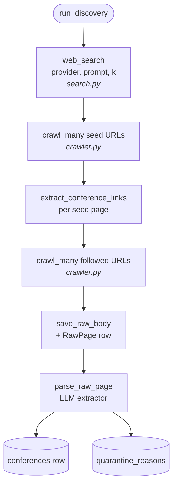

# Scout — Web discovery

> How Scout finds AI conferences. Companion to
> [`ARCHITECTURE.md`](ARCHITECTURE.md); operator-facing runbook lives
> at [`ops/runbook.md`](ops/runbook.md).

## Overview

Scout has two complementary sources for AI conferences. The
**bulk JSON feed** (`developers.events`, ~5,773 events at last count)
is the workhorse: structured rows arrive with dates, location, CFP
link, and tags already cleaned up, so they bypass the LLM extractor
entirely. The **on-demand web crawl** (search → Crawl4AI fetch →
LLM extract) is the fallback for events that never make it into the
feed and for the nightly background top-up. Both paths converge on
the same `conferences` table, embedding pipeline, and matcher, so
downstream code never branches on origin.

## Sources

- **`developers.events/all-events.json`** — primary. Maintained
  community feed with structured fields (`name`, `date`, `location`,
  `country`, `hyperlink`, `cfp.link`, `cfp.untilDate`, `tags`,
  `status`). Trusted enough that Scout writes the row at
  `confidence_score=0.9` without any LLM round-trip. Implementation
  in `app/services/web_discovery/feeds.py`.

- **Crawl4AI seed URLs.** Operator-editable via the
  `discovery_seed_urls` setting (default: aideadlin.es, wikicfp.com,
  papercall.io, sessionize.com, lu.ma/discover, eventbrite,
  huggingface.co/blog). These are aggregator pages — the page itself
  is `not_a_conference`, but each one lists many. The orchestrator
  follows outbound conference-looking links one level deep, capped
  per seed via `discovery_max_links_per_seed`.

- **Web search.** Pluggable provider, chosen at runtime via the
  `discovery_search_provider` setting:
  - `ddg` (default) — DuckDuckGo via the `ddgs` package
    (`duckduckgo_search` was renamed and deprecated upstream). No
    API key. Occasionally rate-limited; the adapter retries up to
    3 times with a short-prompt fallback.
  - `brave` — Brave Search API. Free tier 1 query/sec, 2000/month.
    Requires `discovery_brave_api_key`.
  - `tavily` — Tavily AI-friendly search. Free tier 1000/month.
    Requires `discovery_tavily_api_key`.

## AI filter

A single multilingual keyword list drives both feed filtering and
later URL-prioritization decisions. The list is editable as
`discovery_ai_keywords` from `/settings/tunables`; the default
ships with **148 keywords** spanning:

- English core: `ai`, `ml`, `llm`, `agentic`, `rag`, `transformer`, `mlops`, …
- English platforms: `huggingface`, `vllm`, `kserve`, `ray`, `mlflow`, …
- English adjacent: `alignment`, `fairness`, `responsible ai`, …
- Spanish: `inteligencia artificial`, `aprendizaje automático`, …
- Portuguese: `inteligência artificial`, `aprendizado de máquina`, …
- French: `intelligence artificielle`, `apprentissage automatique`, …
- German: `künstliche intelligenz`, `maschinelles lernen`, …
- Japanese: `人工知能`, `機械学習`, `深層学習`, …
- Chinese (simplified): `人工智能`, `机器学习`, `深度学习`, …
- Korean: `인공지능`, `머신러닝`, `딥러닝`, …

The filter does a case-insensitive substring match against the
event's name + topics + description blob. An operator can widen the
list to catch more events or tighten it to reduce noise without
redeploying.

## Pipeline

The end-to-end flow when the user clicks "Discover more" on
`/conferences`:

1. **Request.** Browser issues
   `POST /api/v1/admin/discovery/ingest-feed`.
2. **Fetch.** `feeds.py` GETs `https://developers.events/all-events.json`
   via `httpx` with a 30-second timeout and a Scout user agent.
3. **Filter.** Each event is passed through three gates: AI keywords
   (multilingual), future-only (`start_date >= today`), and
   `status == "open"`.
4. **Normalize + persist.** `_normalize_entry` reshapes the row
   into the `Conference` schema (epoch-ms dates → `date` objects;
   country name → ISO-3166-1 alpha-2; tags coerced from
   strings-or-dicts to strings). `_persist_event` upserts by slug;
   for existing rows it only fills NULL fields so a human-curated
   bio is never overwritten by a feed re-ingest.
5. **Embed inline.** `embed_owner(..., purpose="embed:feed_conference")`
   runs immediately so the matcher's Stage A + B can score the row
   the moment it lands. Without this, every feed-ingested row would
   show messaging/pillar scores of 0 on first view.
6. **Commit + invalidate.** A single `db.commit()` at the end of
   the batch plus a graph-cache invalidation tick.

The on-demand crawl path (used by the nightly APScheduler cron
and the `POST /api/v1/admin/discovery/run` endpoint) sits in
`web_discovery/orchestrator.py`:

## Geocoding

Events arrive with `(city, country)` but no coordinates. The
`app/services/geocoding.py` module uses Nominatim (OSM, free, no
API key) with the upstream-mandated 1 req/sec policy:

- 1.05-second sleep after every successful request (clear of the
  cliff)
- process-wide `asyncio.Lock` so concurrent callers serialize
- real `User-Agent` with a contact email
- silent skip on any error (network, no result, parse) — never
  raises into the caller

One-shot backfill via
`POST /api/v1/admin/discovery/geocode-backfill`. The function commits
every 20 rows so the dashboard map populates incrementally rather
than waiting for the full run; ~500 rows backfills in roughly 9
minutes. Coordinates are persisted to `Conference.latitude` /
`Conference.longitude` (migration
`20260523_0100_conferences_latlng`).

## The map

The dashboard `WorldMap` component
(`apps/web/src/components/dashboard/WorldMap.tsx`) reads
`GET /api/v1/conferences/stats/by-location`. It clusters by
`(city, country)` and draws one red dot per city, sized by
`sqrt(count / max_count)` so popular cities pop without crowding
out the long tail. Hover shows a preview; click pins the popover;
click a conference name to open its detail page.

The TopoJSON world map is self-hosted at
`/world-110m.json` (in `apps/web/public/`). `react-simple-maps`
v3 has a documented bug where its default CDN URL silently fails to
fetch on some networks, blanking the map — bundling our own copy
eliminates that class of "blank dashboard, no error in console"
failure.

## Tuning

All discovery levers live under `/settings/tunables` and persist in
the `settings_overrides` table (no redeploy needed):

| Setting | Default | Purpose |
|---------|---------|---------|
| `discovery_ai_keywords` | 148 multilingual terms | Feed + crawl AI filter |
| `discovery_seed_urls` | 8 aggregator URLs | Always-crawled hub pages |
| `discovery_url_blocklist` | wikipedia, openreview, social media | Substring-match skip list |
| `discovery_search_provider` | `ddg` | `ddg` / `brave` / `tavily` |
| `discovery_brave_api_key`, `discovery_tavily_api_key` | — | Provider credentials |
| `discovery_max_links_per_seed` | 30 | Per-seed follow-link cap |
| `discovery_max_results_per_run` | 20 | Per-run conference cap |
| `discovery_cron_hour_utc` | 6 | When the nightly background run fires |

## Failure modes & recovery

- **DDG rate-limit.** The adapter retries up to 3 times with a
  shortened prompt fallback. Persistent failure logs
  `discovery.search.failed` and the orchestrator continues with
  just the seed URLs — discovery still produces results from the
  aggregator floor.
- **LLM extraction returns `name=Unknown`.** Short-circuited in
  the extraction pipeline; no `conferences` row is written. The
  raw page stays around so the operator can inspect it via
  `GET /api/v1/conferences/{id}/sources` (or the raw_pages diag
  endpoint).
- **Docling OOM kill.** The PDF/RAG path's Docling subprocess can
  be OOM-killed on huge or image-heavy PDFs; the wrapper falls back
  to `text_only` mode and finally `pypdfium2`. See
  [ADR-0003](ADR/0003-docling-for-pdf-and-chunking.md) for the
  pipeline-of-fallbacks rationale.
- **Genuine extraction failures.** A `quarantine_reasons` row is
  written with the failure category so the operator can either
  whitelist the URL pattern, edit the page manually, or just leave
  it quarantined.
- **Nominatim lookup miss.** Returns `None` silently; the row stays
  un-geocoded and simply doesn't appear on the map until the next
  backfill (or until the operator corrects the city spelling).
